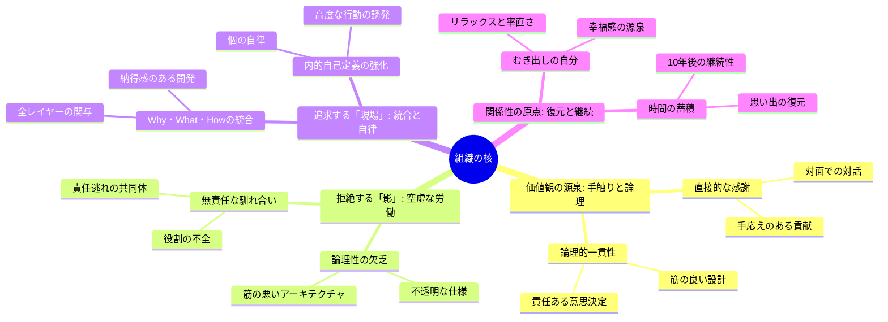

# 組織のミッションやポリシーを考える

## 4つの分析アプローチ

単なる「ビジネスプラン」ではなく、**個人の情熱と嫌悪感（情動）** に根ざした組織の輪郭が見えてきます。
これらを組織のミッションやポリシーに昇華させるために、以下の**4つの分析アプローチ** が有効です。

---

### 1. 価値観の「正・負」対照分析

ミッション（何を成すか）と同じくらい、ポリシー（何をしないか／何を許さないか）を明確にする手法:

* **分析方法:** 回答1（光）と回答2（影）を対照させます。
* **抽出されるエッセンス:** **光:** 物理的な手応え、直接的な感謝、論理的な一貫性、Why/What/Howの統合。
* **影:** 責任逃れ、不透明な意思決定、論理性への軽視、役割の不全。

* **組織への適用:** 「私たちは、論理を欠いた馴れ合いを拒絶し、手触りのある貢献を追求する」といった、**「美学」と「忌避」** の境界線が引けます。

<!-- truncate -->

### 2. 「Why-What-How」統合モデル分析

回答3で「すべてを統合する場面にいたい」と明言されている点を深掘りします。

* **分析方法:** 組織の活動を「Why（なぜやるか：内的自己定義）」「What（何をやるか：高度な行動）」「How（どうやるか：エンジニアリング・対話）」の3層で整理します。
* **抽出されるエッセンス:** 回答3にある「個々人の内的自己定義を強化する」という関心は、そのまま組織の**社会的意義（Why）** になり得ます。
* それを実現するための「高度に行動を促す仕組み」が**製品やサービス（What）** になります。

### 3. コミュニティ・アイデンティティ分析

回答4と5から、この3人の「関係性の質」を組織文化のベースとして抽出します。

* **分析方法:** 「3人でいるときだけ出る自分の一面（むき出し、リラックス）」を、組織の「心理的安全性の定義」として言語化します。
* **抽出されるエッセンス:** 「過去の保存」「原点」「復元」といったキーワードから、**「時間の蓄積を重んじる」「誠実な関係性を継続する」** という組織文化が見えます。
* これは顧客に対しても「一過性の支援ではなく、歴史を共に作る」というポリシーに変換可能です。

### 4. 「ナラティブ（物語）」からのキーワード抽出

3人の共通言語や、特に熱量の高いフレーズを抜き出します。

* **抽出されたキーワード例:**
* 「内的自己定義」
* 「手触り（対面・直接）」
* 「論理性の欠乏への怒り」
* 「思い出の復元」

---

### 次のステップへの提案

これらの分析を踏まえて、まずは**「自分たちが絶対に許せないことリスト（アンチ・ポリシー）」** と**「10年後もこの3人で笑っているための条件」** を言語化してみるのはいかがでしょうか？

**「何に突き動かされ、何を拒絶し、何を理想とするか」** という心の動きを整理したもの

## マインドマップ

**「何に突き動かされ、何を拒絶し、何を理想とするか」** という心の動きを整理。

マインドマップから見えた組織のポリシー（行動指針）の種:  

* 「論理の防衛線」: 回答2にある「怒り」を、単なる感情で終わらせず、「論理的に説明できない決定は行わない」「責任の所在を曖昧にしない」という **鉄の掟（ポリシー）** に変換できます。
* 「手触り至上主義」: どんなに自動化やAIが進んでも（回答3）、最後は「対面での感謝」や「現場の空気感」を重視する独自の評価軸が持てます。
* 「復元可能な関係」: 効率一辺倒ではなく、3人の関係性が「原点」として機能し続けるための **メンテナンス（定期的な集まりや思い出の共有）** 自体を組織の活動に組み込む重要性が示唆されています。

## 組織の憲章（アイデンティティ・トライアングル）

「組織の宣言」「基本原則」「実践方法」の3層構造で整理すると、非常に一本の筋が通った強い組織像が浮かび上がります。

---

### 1. 組織の宣言（Mission / Purpose）

**「Why・What・Howを統合し、不条理のない『意味のある現場』をプロトタイピングし続ける」**

* **解説:** 「意味が見えない仕事」や「論理の欠乏」を徹底的に排除し、自分たちが納得できる（Why）、価値のあるものを（What）、正しい技術と論理で（How）作り上げる状態を、組織の存在意義とします。

---

### 2. 基本原則（Guiding Principles）

組織が意思決定に迷った際に立ち返る3つの軸です。

* **論理の防衛（Anti-Shit Work）**
* 「責任を負えない弱者の共同体」に成り下がらない。論理的に説明できない決定や、筋の悪いアーキテクチャには断固として「NO」を突きつける。

* **内的自己定義の尊重（Self-Definition）**
* 外圧や空気に流されるのではなく、個々人が「自分は何を成したいか」という内発的な動機に基づいて行動することを、組織のエンジンとする。

* **「むき出し」の誠実さ（Authentic Relationship）**
* 社会的な肩書きや役割に隠れず、素の自分で対話できる関係性を維持する。そのリラックスした状態こそが、最高の幸福とパフォーマンスを生むと信じる。

---

### 3. 実践方法（Practices）

日々の活動で具体的に何を行うか、という行動指針です。

* **「手触り」の確認（Direct Feedback）**
* どれほど開発が高度化しても、顧客との「対面」を軽視しない。直接的な感謝や反応をエネルギー源として循環させる仕組みを持つ。

* **三位一体の設計（Integration Ritual）**
* 「作る（How）」だけに逃げない。常に「なぜ（Why）」「何を（What）」をセットで議論し、どれか一つが欠けているプロジェクトには介入または修正を行う。

* **「記憶の復元」ミーティング（Memory Restoration）**
* 定期的に、役割を脱ぎ捨てて「原点」に立ち返る時間を設ける。10年後も関係性を維持するために、成功だけでなく、当時の感情や思い出を共有・更新し続ける。

---

### 構成のポイント

この整理の肝は、**回答2で語られた「怒り」を、回答4・5の「信頼」で中和・昇華させている点**にあります。

* **外向き（仕事）** には、徹底的に論理的でプロフェッショナルな「統合者」として振る舞う。
* **内向き（仲間）** には、徹底的にリラックスした「むき出しの自分」を保存する。

この**「論理の鎧（よろい）」と「むき出しの心」の使い分け** こそが、この3人ならではの強み（ポリシー）になると感じました。
