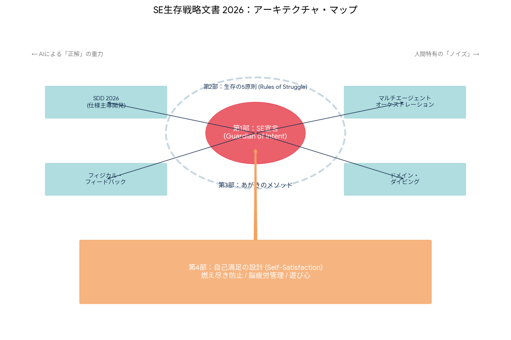

# 砂場録文書'26

\- 自動化される開発の先にある、エンジニアの『面白さ』と『ドメイン』の再定義

## 概要

LLMの劇的な進歩とAIエージェントの自律化により、エンジニアが長年積み上げてきた「コードを書き、システムを組み上げる」という知識は、かつての職人技が機械化されたように、その価値を急速に失いつつある。

この転換期において、我々に求められるのは、ITスキルを単なる手段として使いこなし、特定のドメイン（領域）に対して何を実現するかという「構想力」と、深みのある「ドメイン知識」である。

しかし、効率化の果てに待っているのが、人間が介在しない無機質な開発プロセスであってはならない。AIエージェントによる自動開発が前提となる今こそ、エンジニア自身がいかにして「創る楽しさ」を見出し、自らの美学を投影したプロダクトを追求できるか。本稿では、2026年以降のエンジニアが、技術の波に呑まれるのではなく、それを乗りこなして「面白い」を創造し続けるための宣言・原則・実践方法・マインドセットを提示する。

